# 📘 EININIDII – Malha de Controle de Tiragem (CODESYS)
> **Professor:** Josué Silva de Morais  
> **Disciplina:** Instrumentação Industrial II  
> **Curso:** Engenharia de Controle e Automação  
> **Instituição:** Universidade Federal de Uberlândia — FEELT  

---

## Colaboradores

Este projeto é resultado de um esforço conjunto. A participação das pessoas abaixo foi essencial:

- **Keslley Brito Ramos** - 11921EAU002
- **Luiz Felipe Carneiro De Oliveira** - 12211EAU022

A cada um(a), nosso agradecimento pelo compromisso, pela parceria e pela qualidade do trabalho entregue.

---

## 📑 Índice
- [1. Acesso e Estrutura da Malha de Tiragem](#1-acesso-e-estrutura-da-malha-de-tiragem)
- [2. Importação de Bibliotecas e Blocos Funcionais](#2-importação-de-bibliotecas-e-blocos-funcionais)
- [3. Configuração das Variáveis de Controle](#3-configuração-das-variáveis-de-controle)
- [4. Desenvolvimento da Lógica de Controle](#4-desenvolvimento-da-lógica-de-controle)
  - [4.1. Bloco 1: Conversão do Sinal do Sensor (LIN_TRAFO)](#41-bloco-1-conversão-do-sinal-do-sensor-lin_trafo)
  - [4.2. Bloco 2: Controlador PID](#42-bloco-2-controlador-pid)
  - [4.3. Bloco 3: Conversão do Sinal de Saída (LIN_TRAFO)](#43-bloco-3-conversão-do-sinal-de-saída-lin_trafo)
  - [4.4. Bloco 4: Conversão de Tipo de Dado (REAL_TO_WORD)](#44-bloco-4-conversão-de-tipo-de-dado-real_to_word)

---

## 1. Acesso e Estrutura da Malha de Tiragem

Para iniciar o desenvolvimento do sistema de controle de tiragem, é necessário acessar o projeto previamente disponibilizado no ambiente CODESYS. A malha de controle está localizada no caminho específico: **Lógica → Application → TIRAGEM**.

A Figura 1 ilustra a interface do CODESYS com a localização da malha de tiragem destacada.

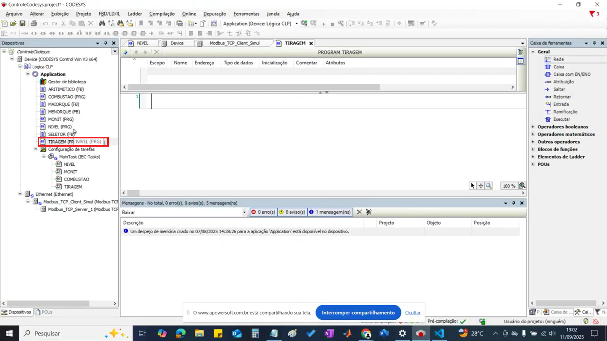

O desenvolvimento desta malha de controle exigirá a utilização de três blocos funcionais distintos:

- **LIN_TRAFO:** Para a transformação linear de sinais
- **PID:** O controlador principal da malha  
- **REAL_TO_WORD:** Para a conversão de tipos de dados, necessária para a comunicação

A Figura 2 apresenta o diagrama geral da malha de controle, mostrando a interconexão entre os blocos funcionais.

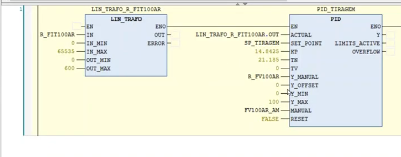

---

## 2. Importação de Bibliotecas e Blocos Funcionais

Os blocos LIN_TRAFO e PID não são componentes nativos do ambiente CODESYS e precisam ser importados por meio de uma biblioteca externa. O bloco REAL_TO_WORD, por sua vez, é nativo e pode ser encontrado diretamente na caixa de ferramentas.

Para realizar a importação dos blocos externos, siga os passos abaixo:

1. No navegador do projeto, acesse o **Gestor de biblioteca** dentro da Application
2. Clique em **Adicionar biblioteca**
3. Pesquise pela biblioteca **"Util"**

A Figura 3 demonstra o processo de acesso ao Gestor de bibliotecas no CODESYS.

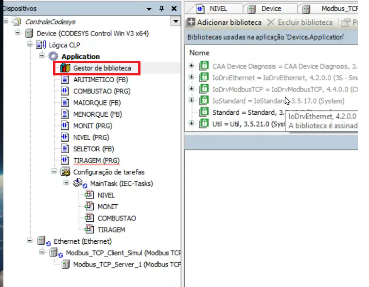

A Figura 4 mostra a interface de pesquisa e seleção da biblioteca "Util".

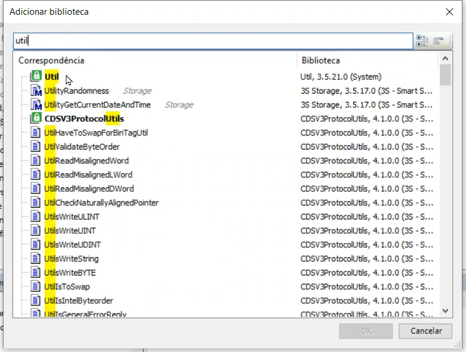

Dentro da biblioteca "Util", o bloco LIN_TRAFO pode ser encontrado na pasta "Mathematical Functions", e o bloco PID está localizado na pasta "Controller", conforme ilustrado nas Figuras 5 e 6.

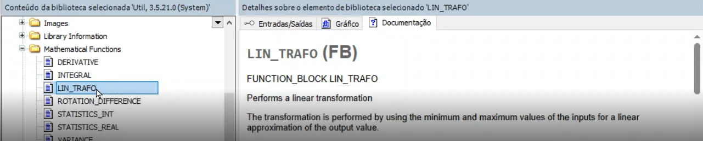

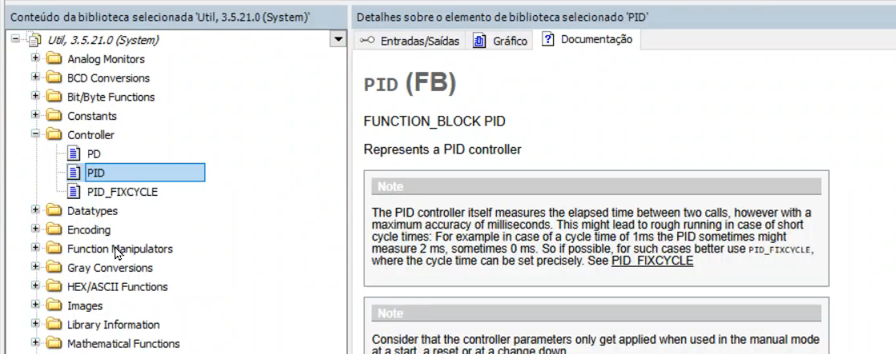

O bloco REAL_TO_WORD é um componente nativo e pode ser encontrado na **Caixa de ferramentas**, na seção **Conversão**, como mostra a Figura 7.

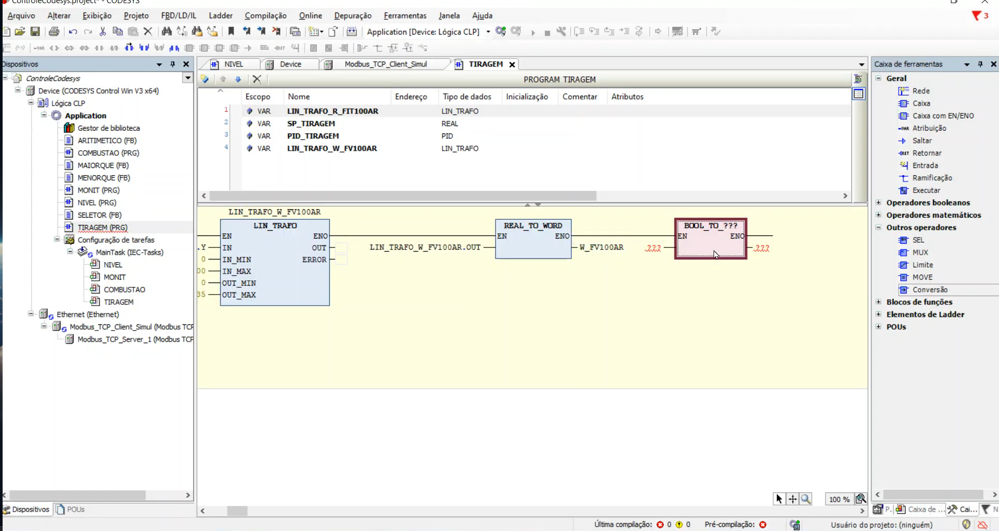

---

## 3. Configuração das Variáveis de Controle

As principais variáveis utilizadas nesta malha de controle são:

- **FIT100AR:** Representa a vazão de ar
- **FV100AR:** Corresponde à válvula que controla a vazão de ar

A Figura 8 apresenta a tela de configuração das variáveis no CODESYS.

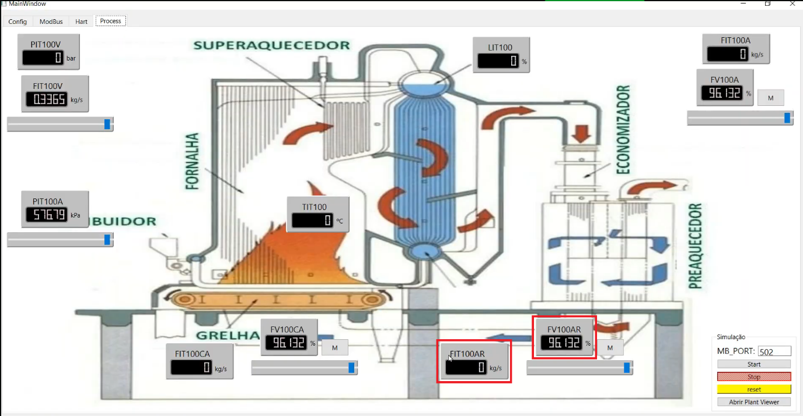

A configuração dessas variáveis envolve associá-las aos respectivos terminais dos blocos. Para variáveis provenientes da comunicação Modbus, siga este procedimento:

1. Clique nas reticências (...) do campo de entrada do bloco onde a variável será utilizada
2. Na janela do **Assistente de entrada**, navegue até IoConfig_Globals_Mapping, onde as variáveis de comunicação Modbus estão listadas
3. Selecione a variável desejada

A Figura 9 ilustra o processo de seleção das variáveis através do Assistente de entrada.

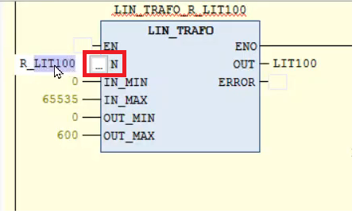

A Figura 10 mostra a navegação até as variáveis Modbus no IoConfig_Globals_Mapping.

Para a leitura do sensor de vazão, utilize a tag **R_FIT100AR**, conforme demonstrado na Figura 11.

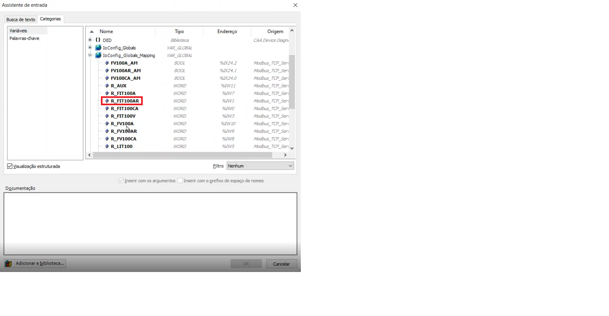

---

## 4. Desenvolvimento da Lógica de Controle

A construção da malha de tiragem é realizada em etapas sequenciais, configurando cada bloco para sua função específica. Esta seção detalha o desenvolvimento dos quatro blocos principais que compõem o sistema de controle.

### 4.1. Bloco 1: Conversão do Sinal do Sensor (LIN_TRAFO)

A primeira etapa consiste em ler e normalizar o sinal do sensor de vazão de ar (FIT100AR). O valor proveniente da comunicação Modbus é um inteiro de 2 bytes, com uma faixa de 0 a 65535. Para que esse valor seja compatível com o bloco PID, ele deve ser normalizado para uma escala de 0 a 600, utilizando o bloco LIN_TRAFO.

**Configuração do LIN_TRAFO:**
- **Entrada (IN):** R_FIT100AR (variável do Modbus)
- **Entrada (IN_MIN):** 0
- **Entrada (IN_MAX):** 65535
- **Saída (OUT_MIN):** 0
- **Saída (OUT_MAX):** 600

A Figura 12 mostra o diagrama de configuração do bloco LIN_TRAFO para conversão do sinal do sensor.

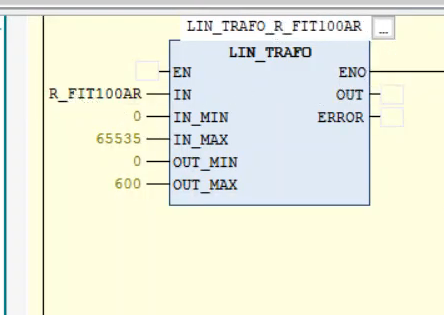

Ao inserir o bloco, ele deve ser instanciado com um nome único, por exemplo, **LIN_TRAFO_R_FIT100AR**, conforme ilustrado na Figura 13.

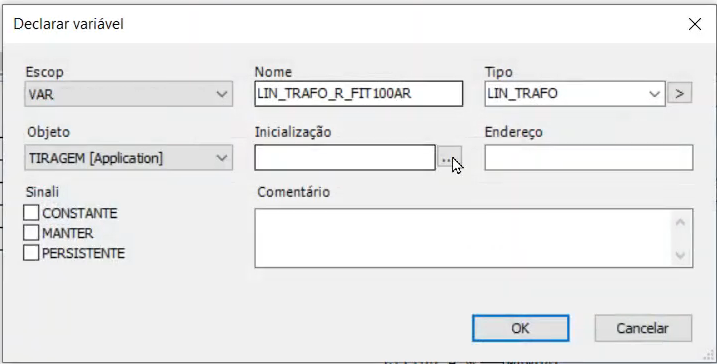

> 💡 **Importante:** A saída normalizada deste bloco (LIN_TRAFO_R_FIT100AR.OUT) será conectada à entrada ACTUAL do controlador PID.

### 4.2. Bloco 2: Controlador PID

O bloco PID é o núcleo da malha de controle. Sua configuração detalhada é apresentada a seguir:

**Configuração das entradas:**
- **ACTUAL:** Conectada à saída do primeiro LIN_TRAFO (LIN_TRAFO_R_FIT100AR.OUT)
- **SET_POINT:** Associada à variável SP_TIRAGEM (deve ser declarada como REAL)
- **Y_MANUAL:** Conectada à variável R_FV100AR (valor de abertura da válvula em modo manual)

A Figura 14 mostra a conexão da entrada ACTUAL do controlador PID.

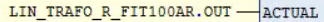

A Figura 15 ilustra a configuração do setpoint SP_TIRAGEM.

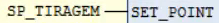

A Figura 16 apresenta a interface completa de configuração das entradas do controlador PID.

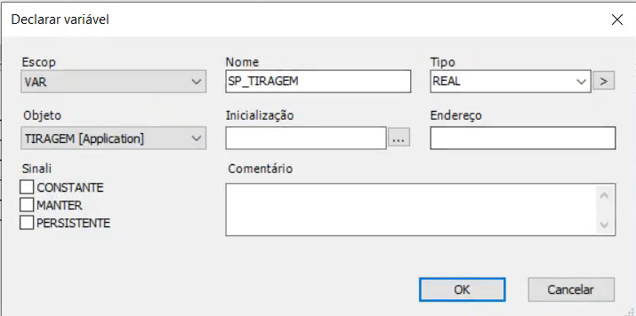

**Parâmetros de sintonia:**
- **KP (Ganho Proporcional):** 14.8425
- **TN (Tempo Integral):** 21.185
- **TV (Tempo Derivativo):** 0

A Figura 17 mostra a configuração dos parâmetros de sintonia do controlador.

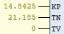

**Configuração de limites e modo:**
- **Y_MIN:** 0
- **Y_MAX:** 100
- **Y_OFFSET:** 0
- **MANUAL:** Conectada à variável FV100AR_AM (seleção automático/manual)
- **RESET:** Configurado com FALSE

A Figura 18 ilustra a configuração da entrada manual Y_MANUAL.

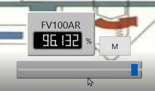

A Figura 19 mostra a configuração dos limites de saída do controlador.

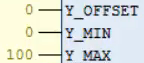

A Figura 20 apresenta a configuração do modo de operação automático/manual.

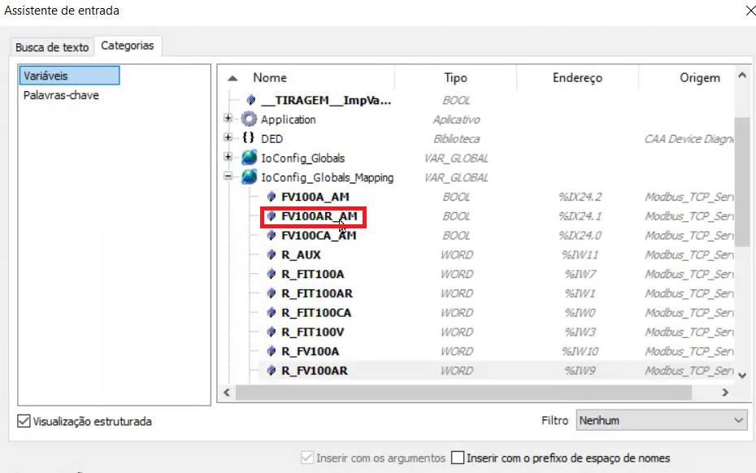

O bloco de PID completamente configurado deve ficar conforme mostrado na Figura 21.

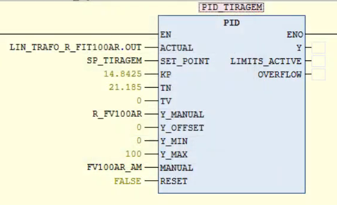

Este bloco deve ser instanciado com um nome, como **PID_TIRAGEM**, conforme ilustrado na Figura 22.

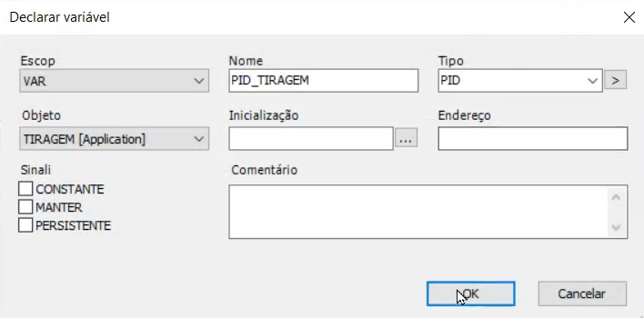

### 4.3. Bloco 3: Conversão do Sinal de Saída (LIN_TRAFO)

A saída do controlador PID (PID_TIRAGEM.Y), que opera em uma faixa de 0 a 100, precisa ser convertida de volta para o padrão da comunicação Modbus (0 a 65535) antes de ser enviada para o atuador (válvula FV100AR). Um segundo bloco LIN_TRAFO é utilizado para esta finalidade.

**Configuração do segundo LIN_TRAFO:**
- **Entrada (IN):** PID_TIRAGEM.Y (saída do controlador PID)
- **Entrada (IN_MIN):** 0
- **Entrada (IN_MAX):** 100
- **Saída (OUT_MIN):** 0
- **Saída (OUT_MAX):** 65535

A Figura 23 mostra o diagrama de configuração do segundo bloco LIN_TRAFO.

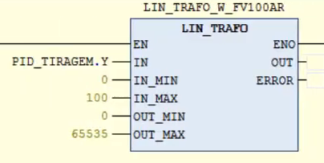

### 4.4. Bloco 4: Conversão de Tipo de Dado (REAL_TO_WORD)

Finalmente, como a comunicação Modbus requer um formato de dados do tipo WORD, é necessário converter a saída do último bloco LIN_TRAFO (que é do tipo REAL) para WORD.

**Configuração do REAL_TO_WORD:**
- **Entrada:** LIN_TRAFO_W_FV100AR.OUT (saída do bloco de conversão anterior)
- **Saída:** Conectada à variável do registro Modbus responsável por escrever na válvula, W_FV100AR

A Figura 24 apresenta o diagrama completo com a conversão REAL_TO_WORD.

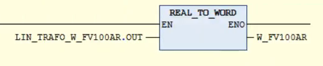

---

### ✅ Observações Finais

- Certifique-se de que todas as variáveis estejam corretamente mapeadas nos registros Modbus correspondentes
- Valide a comunicação entre o CODESYS e o sistema SCADA antes de colocar a malha em operação
- Realize testes em modo manual antes de ativar o controle automático
- Documente quaisquer alterações nos parâmetros de sintonia para futuras referências

---

**INSTRUÇÕES PARA MONTAR O PROJETO:**

1. **Execute este código Python** para gerar o arquivo README.md
2. **Crie uma pasta** chamada `imgs` no mesmo diretório
3. **Extraia as imagens do documento Word** original para a pasta `imgs`
4. **Renomeie as imagens** conforme a numeração usada (image1.png, image2.png, etc.)

**PARA EXTRAIR IMAGENS DO DOCX:**
- Renomeie o arquivo .docx para .zip
- Extraia o conteúdo
- Copie as imagens da pasta `word/media/` para a pasta `imgs`
- Renomeie conforme necessário
'''